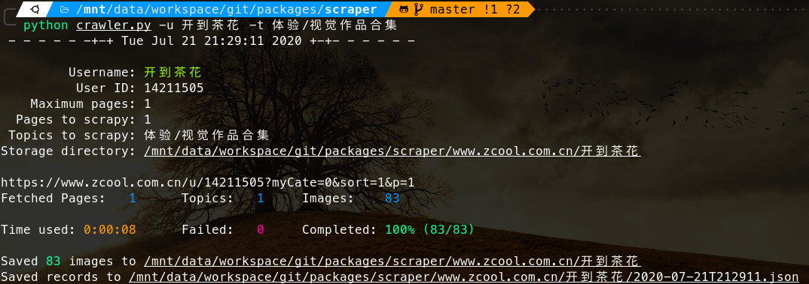
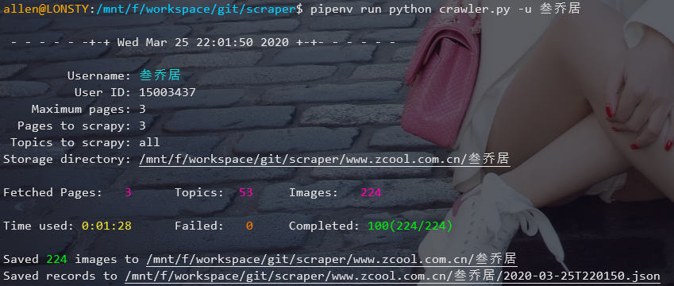

# scraper

极速爬取下载站酷（[https://www.zcool.com.cn/](https://www.zcool.com.cn/)）`设计师/用户`上传的全部`图片/照片/插画`。

### 特点：

- [x] 极速下载：多线程异步下载，可以根据需要设置线程数
- [x] 异常重试：只要重试次数足够多，就没有下载不下来的图片 \(^o^)/！
- [x] 增量下载：设计师/用户有新的上传，再跑一遍程序就行了 O(∩_∩)O 嗯！
- [x] 自选主题：可以选择下载用户的特定主题，而不是该用户下的所有内容
- [x] 超清原图（NEW）：从 V0.1.2 开始，默认下载超清原图（约几 MB），使用参数`--thumbnail`下载缩略图（宽最大 1280px，约 500KB）

### 环境：

- `python3.6` 及以上

# 快速使用

## 1. 克隆项目到本地

```
$ git clone https://github.com/lonsty/scraper.git
```

## 2. 安装依赖包

```
$ cd scraper
$ pip install -r requirements.txt
```

## 3. 快速使用

下载用户名为 `username` 的所有图片到路径 `path` 下：

```
$ python crawler.py -u <username> -d <path>
```

运行截图





爬取结果


# 使用帮助

### 常用命令

1. 只下载用户的**部分主题**

```
$ python crawler.py -u <username> -t <topic1>,<topic2>,...
```

2. 一次性下载**多个用户**的所有图片

```
$ python crawler.py -u <username1>,<username2>,...
```

3. 部分图片**下载失败**或有**更新**，再执行相同的命令，对失败或新增的图片进行下载

```
$ python crawler.py -u <username> -d <last-saved-path>
```

### 查看所有命令

```
$ python crawler.py --help

Usage: crawler.py [OPTIONS]

  Use multi-threaded to download images from https://www.zcool.com.cn by
  usernames or IDs.

Options:
  -u, --usernames TEXT    One or more user names, separated by commas.
  -i, --ids TEXT          One or more user ids, separated by commas.
  -t, --topics TEXT       Specific topics of this user to download, separated
                          by commas.
  -d, --destination TEXT  Directory to save images.
  -R, --retries INTEGER   Repeat download for failed images.  [default: 3]
  -r, --redownload TEXT   Redownload images from failed records.
  -o, --overwrite          Override existing files.  [default: False]
  --thumbnail             Download thumbnails with a maximum width of 1280px.
                          [default: False]
  --max-pages INTEGER     Maximum pages to download.
  --max-topics INTEGER    Maximum topics per page to download.
  --max-workers INTEGER   Maximum thread workers.  [default: 20]
  --proxies TEXT          Use proxies to access websites.
                          Example:
                          '{"http":
                          "user:passwd@www.example.com:port",
                          "https":
                          "user:passwd@www.example.com:port"}'
  --help                  Show this message and exit.
```

# 更新历史

- ## Version 0.1.3 (2020.07.21）

    - 修复了在动态加载页面中无法获取并下载所有图片的问题
    - 保存的图片文件名中加入了序号，方便保持原始顺序
    - 添加了注释，并对一些细节做了调整

- ## 2020.03.25

    - 优化了终端输出信息，用不同颜色文字进行了标识
    - 修复了在低网速下无法下载图片的问题，并加快了整体下载速度

- ## Version 0.1.2 (2020.03.24)

    新功能：
    
    - 新增下载超清原图（默认选项，约几MB），使用参数`--thumbnail`下载缩略图（宽最大1280px，约500KB）
    - 新增支持下载JPG、PNG、GIF、BMP格式的图片

- ## Version 0.1.1 (2019.12.09)

    新功能：
    
    - 可以选择下载用户的特定主题
    - 支持一次性输入多个用户名或 ID
    
    BUG 修复：
    
    - 修复用户如果没有上传任何图片时的下载错误

- ## Version 0.1.0 (2019.09.09)

    主要功能：
    
    - 极速下载：多线程异步下载，可以根据需要设置线程数
    - 异常重试：只要重试次数足够多，就没有下载不下来的图片 \(^o^)/
    - 增量下载：设计师/用户有新的上传，再跑一遍程序就行了 O(∩_∩)O 嗯！
    - 支持代理：可以配置使用代理

# LICENSE

此项目使用 [MIT](LICENSE) 开源协议

**注意**：使用此工具下载的所有作品，版权归原作者所有，请谨慎使用！
