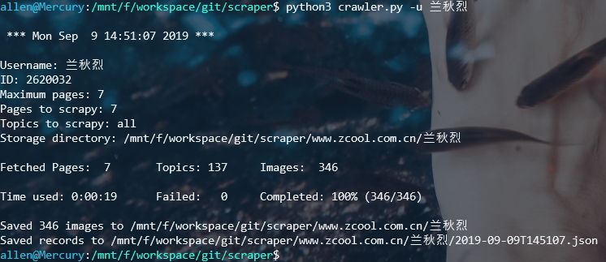

# scraper

极速爬取下载站酷（[https://www.zcool.com.cn/](https://www.zcool.com.cn/)）`设计师/用户`上传的全部`照片/插画`等图片。

### 特点：

1. 极速下载：多线程异步下载，可以根据需要设置线程数
2. 异常重试：只要重试次数足够多，就没有下载不下来的图片 \(^o^)/
3. 增量下载：设计师/用户有新的上传，再跑一遍程序就行了 O(∩_∩)O嗯!
4. 支持代理：可以配置使用代理

### 环境：

- `python3.6`及以上

# 快速使用

## 1. 克隆项目到本地

```
git clone https://github.com/lonsty/scraper
```

## 2. 安装依赖包

```
cd scraper
pip install -r requirements.txt
```

## 3. 快速使用

通过用户名`username`下载所有图片到路径`path`下：

```
python crawler.py -u <username> -d <path>
```

运行截图



爬取结果


# 使用帮助

- 查看所有命令

```
python crawler.py --help
```

```
Usage: crawler.py [OPTIONS]

  Use multi-threaded to download images from https://www.zcool.com.cn in
  bulk by username or ID.

Options:
  -i, --id TEXT              User id.
  -u, --username TEXT        User name.
  -d, --directory TEXT       Directory to save images.
  -p, --max-pages INTEGER    Maximum pages to parse.
  -t, --max-topics INTEGER   Maximum topics per page to parse.
  -w, --max-workers INTEGER  Maximum thread workers.  [default: 20]
  -R, --retries INTEGER      Repeat download for failed images.  [default: 3]
  -r, --redownload TEXT      Redownload images from failed records.
  -o, --override             Override existing files.  [default: False]
  --proxies TEXT             Use proxies to access websites.
                             Example:
                             '{"http": "user:passwd@www.example.com:port",
                             "https": "user:passwd@www.example.com:port"}'
  --help                     Show this message and exit.
```

# 更新历史

- ## Version 0.1.0 (2019.09.09)

    主要功能：
    
    - 极速下载：多线程异步下载，可以根据需要设置线程数
    - 异常重试：只要重试次数足够多，就没有下载不下来的图片 \(^o^)/
    - 增量下载：设计师/用户有新的上传，再跑一遍程序就行了 O(∩_∩)O嗯!
    - 支持代理：可以配置使用代理
